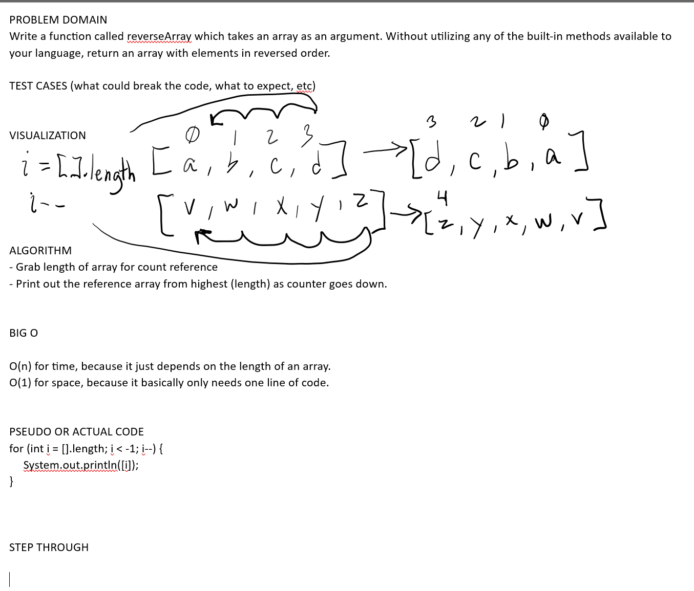

# Data Structures 401

## Implementation Notes

## Code Challenges

### Challenge 01

Location: `codechallenges/linkedlist/LinkedListChallenges`

Method: `linkedListChallenge06()`

# CHALLENGE: Reverse Array

## Whiteboard Process
// Embedded whiteboard image



## Approach & Efficiency
// What approach did you take? Why? What is the Big O space/time for this appoach?

(answer in whiteboard)

## Solution
// Show how to run your code, and examples of it in action

```
int arr = [1, 2, 3, 4, 5, 6];

// (fm screenshot fm lecture)

public static int[] reverseArray(int[] arr) {
  int index = 0;
  while (index < arr.length/2) {
    int temp = arr[index];
    arr[index] = arr[index - 1 - index];
    arr[index - 1 - index] = temp;
    index++;
  }
  return arr;
}
```
