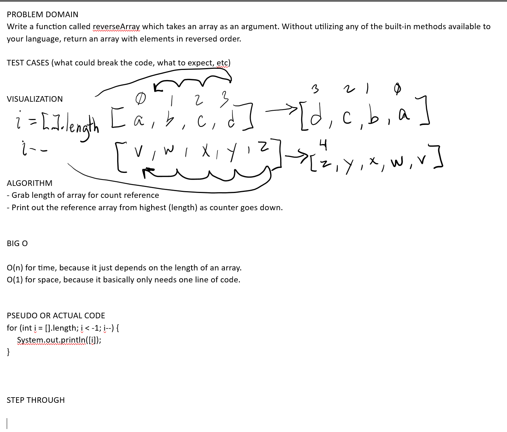

# CHALLENGE: Reverse Array

## Whiteboard Process
// Embedded whiteboard image

## Approach & Efficiency
// What approach did you take? Why? What is the Big O space/time for this appoach?

(answer in whiteboard)

## Solution
// Show how to run your code, and examples of it in action

